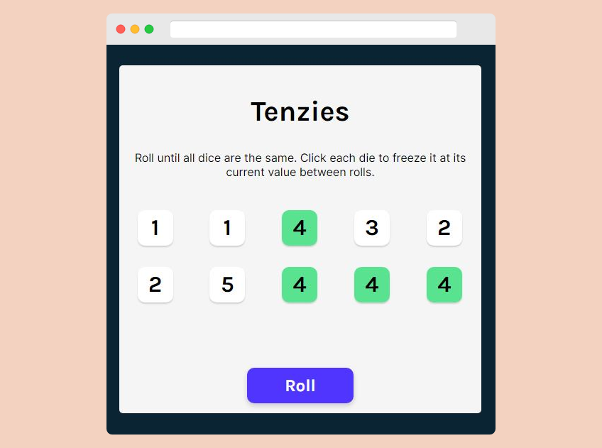

# Tenzies Game 🎲

  

## [Live Site 🔗](https://tenziesgamebyjym.netlify.app/)

## Table of Contents

* [Description](#description)
* [React concepts](#react-concepts)
* [Technologies Used](#technologies-used)

## Description 📝

Tenzies is a popular dice game that encourages fast reactions and is super easy to learn. Roll until all dice are the same. Click each die to freeze it at its current value between rolls.

This project was used to drive forward the React concepts that I have been learning so far. 

## React concepts 💡

The following are some of the topics that I learnt and implemented along the way:

- Spreading objects as props
- Conditional rendering
- useState and useEffect
- useState array destructuring
- Complex state
- Passing state as props
- Unified state

## Technologies Used 👨‍💻
- React
- nanoid
- react-confetti
- HTML
- CSS

## Author
[Jym Bocala](https://github.com/jymbocala)
